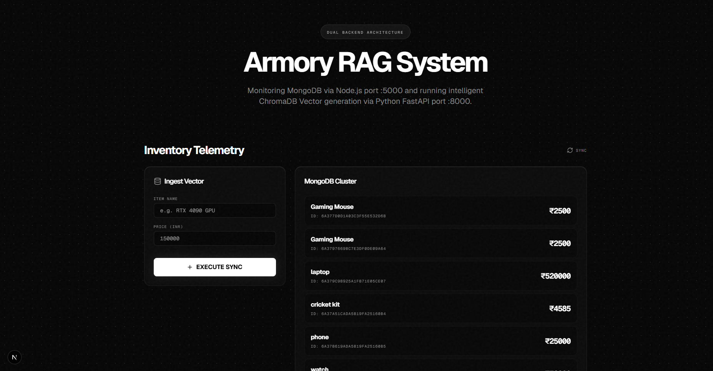
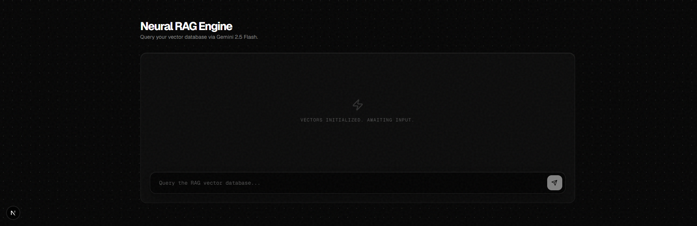
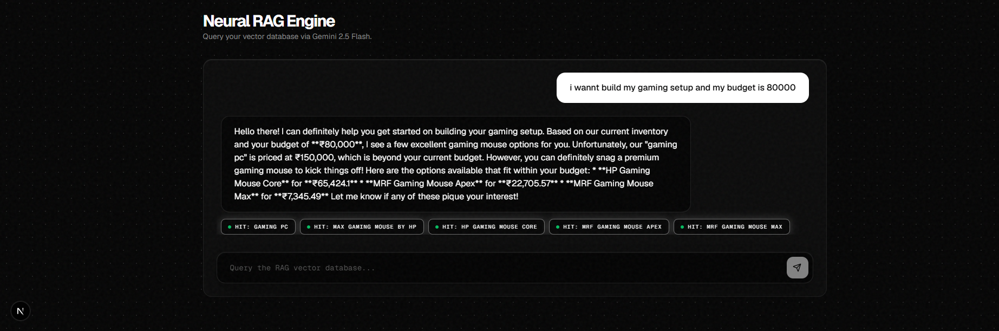

# Intelligent Inventory System
### AI-Powered Inventory Management with Natural Language Search (RAG)

Instead of searching inventory using exact keywords, this application lets you search in plain English.

For example, you can type queries like:

> "Show me affordable laptops under ₹40,000"

or

> "Find wireless headphones with good battery life"

The system retrieves the most relevant inventory items using semantic search and then uses Retrieval-Augmented Generation (RAG) to generate responses grounded only in your own inventory data.

The project is split into three independent services:

- **Next.js** frontend
- **Node.js + Express** API for inventory management
- **Python + FastAPI** AI service for embeddings, vector search, and response generation

The goal of this project was to gain hands-on experience building a complete AI-powered application that combines traditional CRUD operations with modern LLM workflows.

---

## Demo

🎥 **Watch Demo**

**Demo video:** [docs/media/demo.mp4](docs/media/demo.mp4)

---

## Screenshots

| Dashboard |
|-----------|
|  |

| AI Chat |
|---------|
|  |

| Source Attribution |
|--------------------|
|  |

---

## Features

- Natural language inventory search
- Retrieval-Augmented Generation (RAG)
- Semantic search powered by vector embeddings
- Source attribution ("Hit Chips") showing which inventory records were used
- MongoDB + ChromaDB synchronization
- Modern responsive interface built with Next.js
- Separate AI service using FastAPI
- Clean modular architecture

---

## How It Works

1. A new inventory item is added through the frontend.

2. The request is sent to the Node.js API, where it is stored in MongoDB.

3. The Node service notifies the Python backend to generate embeddings for the new item.

4. The embeddings are stored inside ChromaDB.

5. When a user asks a question, the Python service performs semantic search against ChromaDB.

6. The retrieved inventory items are passed to Gemini as context.

7. Gemini generates an answer using only the retrieved inventory data.

This approach minimizes hallucinations because the language model is grounded on your own inventory instead of relying only on its pretrained knowledge.

---

## Architecture

| Service | Technology | Purpose |
|----------|------------|---------|
| Frontend | Next.js, React, Tailwind CSS | User Interface |
| Backend API | Node.js, Express.js, MongoDB | CRUD Operations |
| AI Service | Python, FastAPI, ChromaDB, Gemini | Embeddings, Retrieval & Response Generation |

---

## Tech Stack

### Frontend

- Next.js
- React
- Tailwind CSS
- Framer Motion
- Lucide React

### Backend

- Node.js
- Express.js
- MongoDB Atlas
- Mongoose

### AI

- Python
- FastAPI
- ChromaDB
- Google Gemini
- Vector Embeddings
- Retrieval-Augmented Generation (RAG)

---

## Getting Started

### Clone the repository

```bash
git clone https://github.com/bloody14/intelligent-inventory-system.git

cd intelligent-inventory-system
```

---

### Node Backend

```bash
cd node_backend
npm install
```

Create a `.env`

```env
MONGODB_URI=your_connection_string
PORT=5000
```

Run

```bash
npm start
```

---

### Python AI Backend

```bash
cd py_backend

python -m venv venv

# Windows
venv\Scripts\activate

# Linux / macOS
source venv/bin/activate

pip install -r requirements.txt
```

Create a `.env`

```env
GEMINI_API_KEY=your_api_key
```

Run

```bash
uvicorn main:app --reload
```

---

### Frontend

```bash
cd frontend

npm install

npm run dev
```

Visit

```
http://localhost:3000
```

---

## Current Limitations

- ChromaDB runs locally
- Authentication is not implemented
- Sync is one-way (Node → Python)
- No automated tests yet

---

## Future Improvements

- User authentication
- Cloud-hosted vector database
- Better synchronization and retry handling
- Streaming AI responses
- Docker support
- Unit and integration tests

---

## What I Learned

This project gave me practical experience with:

- Designing multi-service applications
- Integrating Node.js and Python services
- Working with vector databases
- Building Retrieval-Augmented Generation (RAG) pipelines
- Prompt engineering for grounded AI responses
- API communication between independent services

---

## Author

**Kundan Singh**

GitHub:
https://github.com/bloody14

LinkedIn:
https://linkedin.com/in/kundan-singh-95b72824a

---

If you found this project interesting, feel free to ⭐ the repository or connect with me on LinkedIn.